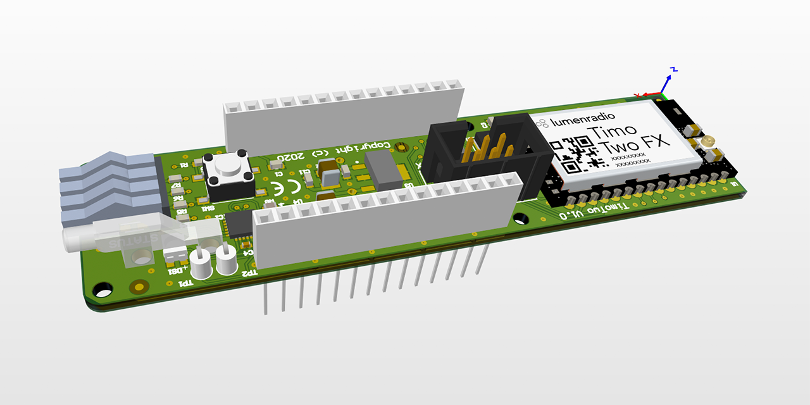

# CRMX_TimoTwo Library
CRMX TimoTwo Library for CRMX TimoTwo MKR Shield

Library works on the CRMX TimoTwo shield

Hardware:
- MKR shield board compatible using only SPI and Pin 5 Select / Pin 6 IRQ
- Based on RadioLumen CRMX TimoTwo transceiver with external antenna
- ANSI E1.11 - DMX512-A and ANSI E1.20 - RDM
- Auto selection of the 88 channels possible 2402-2480 MHz (no WiFi connection) Dynamically avoids occupied frequencies.
- 4 LED's on lightguide for status & RF receiving quality
- 1 RGB LED on lightguide with Universe color
- Button to Link two devices / clear linking
- UART DMX/RDM interface 6 pin header with RX/TX and control signals (3V3 compatible) 
  for extention board with 5-Pin XLR galvanic shielded DMX-512
  - Pin 1: DMX_TXD
  - Pin 2: GND
  - Pin 3: DMX_RXD
  - Pin 4: RS485_DE
  - Pin 5: RS485_RE
  - Pin 6: 3V3
- On board voltage convertors (VIN 5V) to 3V3 and 1V8 to avoid current load on MKR xxxx compatible boards
- The TimoTwo module comprises a BLE based interface that allows for configuration of the device as well as transfer of DMX data to the device (for example Luminair iPad software).

Firmware:
- SPI library to control:
  - Receiver / Transmitter / RF Power modes
  - Data tranmission / receiving of the DMX universe through SPI. RX/TX is not connected to the MKR shield.
    DMX-512 RX/TX is generated in the TimoTwo chip taking off CPU load on the MKR Arm processor. 
  - No need for DMX or RS485 libraries. Can also be used without the RF capability to generate external DMX-512 RX/TX ANSI E1.11 DMX512-A and ANSI E1.20 RDM compliant signals.
  - Settings for TX DMX-512 timings (refresh period / time between channels / amount of channels)
  - IRQ settings and flag control for RF reception, new DMX values etc...
  - RX DMX window settings (Start adress and length of window) for easy implementation of creating a DMX fixture.
  - ASC frame start code and frame receiver
  - Masking of the 88 TX channels.
  - Hardware version / firmware version UID readout
- No need for DMX or RS485 libraries. Can also be used without the RF capability to generate external DMX-512 RX/TX ANSI E1.11 DMX512-A and ANSI E1.20 RDM compliant signals.
  
Copyright (c) 2020 MC-Productions.be
